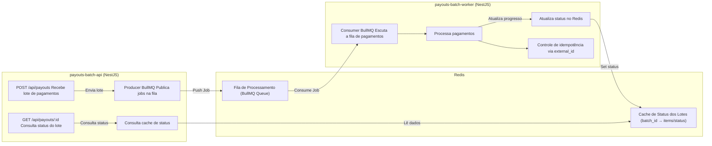

# Desafio Conty – Wesley Damasceno

> **Local da submissão:** `submissions/wesleydmscn/pix`

A aplicação completa pode ser acessada em produção aqui: https://conty-challenge.wesleydmscn.com/docs

## Visão geral

A aplicação é composta por **dois serviços independentes**, que se comunicam por meio de uma **fila Redis**:
- **payouts-batch-api** — responsável por expor endpoints REST (envio e consulta de lotes de pagamentos);
- **payouts-batch-worker** — responsável por consumir os lotes da fila e processar as liquidações.

Essa separação foi pensada para refletir um ambiente de produção, permitindo escalabilidade, resiliência e isolamento de responsabilidades.

## Arquitetura



A arquitetura segue o padrão **event-driven**, utilizando o **BullMQ** como orquestrador de tarefas assíncronas.

#### Fluxo:
- O serviço API recebe um lote de pagamentos (`payouts_batch_example.json`);
- Os itens são validados e enviados para a **fila Redis**;
- O **Worker** consome a fila, processa os pagamentos individualmente e atualiza o status de cada item no Redis;
- A **API** expõe o status atualizado via endpoint `GET /api/payouts/:id`.

### Componentes principais
- **NestJS** — framework base para API e Worker, promove modularidade e injeção de dependências;
- **BullMQ + Redis** — gerencia filas e estados de processamento;
- **Swagger + Scalar** — documentação automática e interativa dos endpoints, além de uma UI agradável;
- **Rate Limiting (Throttler)** — proteção de endpoints com políticas de limite de requisições em dois níveis (médio e longo).

### Principais Decisões e Trade-offs

- **Redis como camada de persistência temporária:**
  - Escolhido pela velocidade e simplicidade no armazenamento de estados em tempo real.
  - **Trade-off**: ausência de persistência durável, impossibilitando rastreabilidade histórica dos pagamentos.

- **Separação de serviços (API e Worker):**
  - Permite **escalabilidade horizontal** e evita que tarefas longas impactem a performance da API.
  - Simula uma topologia de produção com microsserviços independentes.

- **BullMQ:**
  - Utilizado para delegar o processamento assíncrono, com suporte nativo a **retries**, **delays**, **prioridades**, **concorrência configurável** e **monitoramento** via UI.
  - Facilita a adição futura de mecanismos como **dead letter queues** e **rate limiting** por job.

- **Observabilidade limitada:**
  - Atualmente, o sistema conta apenas com **logs estruturados**.
  - Futuras melhorias incluem métricas com **Prometheus** e tracing distribuído com **OpenTelemetry**.

### O que faria diferente com mais tempo

- Implementaria testes automatizados (unitários e de integração) com **Jest** e **Supertest**;
- Adicionaria camada de persistência **PostgreSQL** para histórico de pagamentos e auditoria;
- Expandiria o conjunto de endpoints para permitir relatórios detalhados de todos os lotes;
- Incluiria monitoramento e observabilidade com **Prometheus + Grafana**;
- Melhoraria a **gestão de configuração** e **secrets**, integrando variáveis de ambiente com **Vault** ou **AWS Parameter Store**.

## Como rodar o projeto

### Requisitos:
- Node.js (versão conforme `.nvmrc`)
- NVM (para gerenciar versões do Node)
- Docker + Docker Compose
- Redis (via container)

### Configuração de Variáveis de Ambiente:

Como o sistema possui dois serviços, é necessário configurar variáveis em ambos:
```bash
# Copia o exemplo de configuração para a API
cp payouts-batch-api/env-example payouts-batch-api/.env

# Copia o exemplo de configuração para o Worker
cp payouts-batch-worker/env-example payouts-batch-worker/.env
```

### Inicialização dos Serviços:

Para iniciar o container do Redis, entre na pasta raiz `pix/` e execute:
```bash
docker compose up -d
```
Para iniciar o serviço de API, entre na pasta `payouts-batch-api/` e execute:
```bash
# Para rodar com a versão Node correta do projeto
nvm use
# Para instalar todas as dependências do serviço
npm install
# Para subir o servidor de desenvolvimento em http://localhost:3333
npm run start:dev
```
Para iniciar o serviço de Worker, entre na pasta `payouts-batch-worker/` e execute:
```bash
# Para rodar com a versão Node correta do projeto
nvm use
# Para instalar todas as dependências do serviço
npm install
# Para subir o servidor de desenvolvimento
npm run start:dev
```

## Endpoints/CLI

### `POST /api/payouts`
Envia um lote de pagamentos para processamento na fila.

**Exemplo de requisição:**
```bash
curl -X POST http://localhost:3333/api/payouts \
  -H "Content-Type: application/json" \
  -d @seeds/payouts_batch_example.json
```

**Corpo da requisição:**
```json
{
  "batch_id": "2025-10-05-A",
  "items": [
    {
      "external_id": "u1-001",
      "user_id": "u1",
      "amount_cents": 35000,
      "pix_key": "u1@email.com"
    }
  ]
}
```

**Resposta (201 Created):**
```json
{
  "batch_id": "2025-10-05-A",
  "processed": 0,
  "successful": 0,
  "failed": 0,
  "duplicates": 0,
  "details": [
    {
      "external_id": "u1-001",
      "status": "pending",
      "amount_cents": 35000
    }
  ]
}
```

### `GET /api/payouts/:id`
Consulta o status de um lote de pagamentos.

**Exemplo de requisição:**
```bash
curl http://localhost:8080/api/payouts/2025-10-05-A
```

**Resposta (200 OK):**
```json
{
  "batch_id": "2025-10-05-A",
  "processed": 1,
  "successful": 1,
  "failed": 0,
  "duplicates": 0,
  "details": [
    {
      "external_id": "u1-001",
      "status": "paid",
      "amount_cents": 35000
    }
  ]
}
```

## Documentação Interativa

A documentação completa da API está disponível via **Swagger + Scalar** em:
- Local: http://localhost:3333/docs
- Produção: https://conty-challenge.wesleydmscn.com/docs

## Bibliotecas e Frameworks Principais

- @nestjs/common, @nestjs/core, @nestjs/platform-express
- @nestjs/swagger, @scalar/nestjs-api-reference
- @nestjs/throttler — controle de taxa de requisições (rate limiting)
- @nestjs/bullmq, bullmq — processamento assíncrono e gerenciamento de filas
- class-transformer, class-validator — validação e transformação de DTOs
